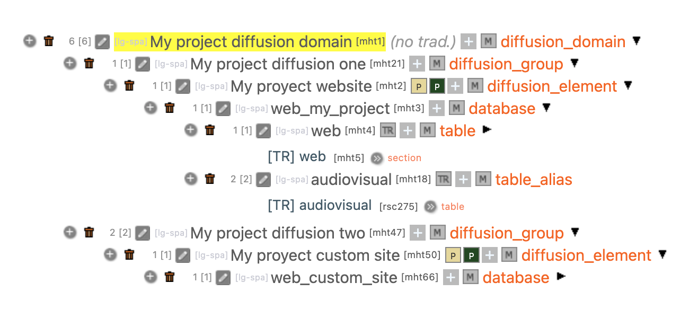
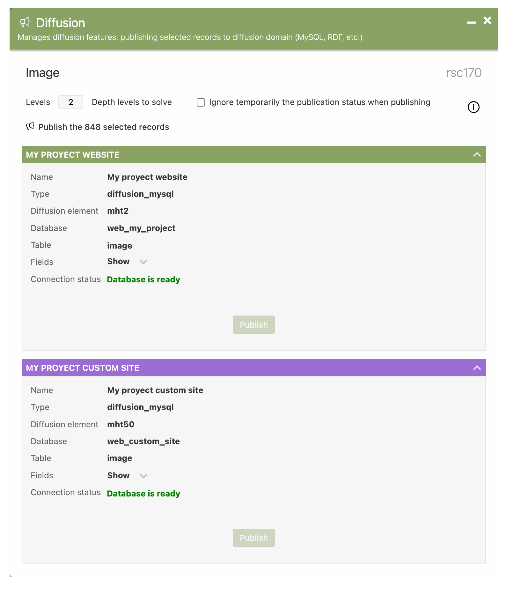
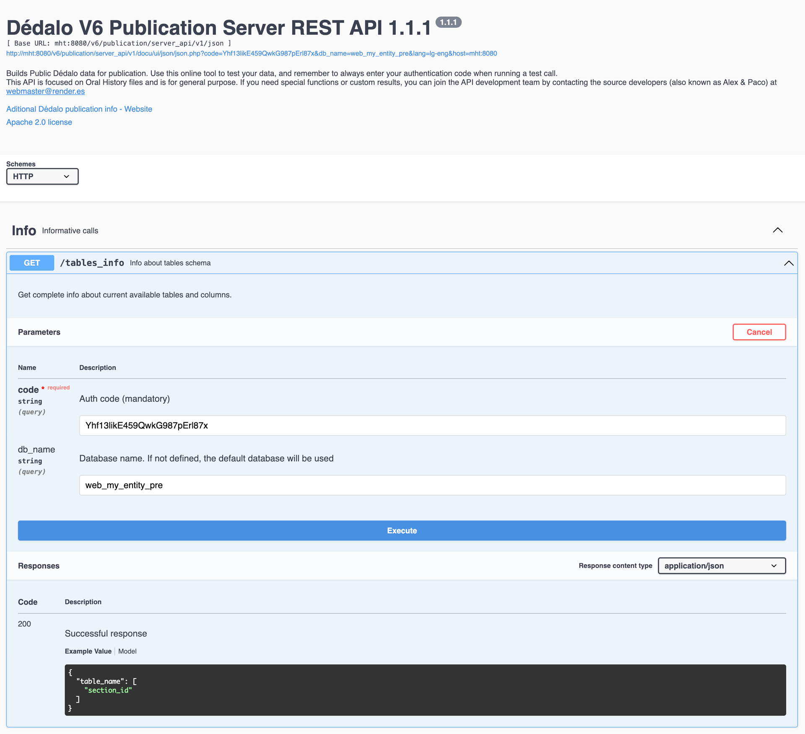

# Diffusion multiple databases (MySQL)

It is possible from Dédalo to publish contents using one or more different databases for a better data organization.
For example, you may want to have a PRE (pre-production) and PRO (production) different databases to allow easy test new schemas or configurations in a private test database before apply the changes to the production public database.
You might also want to organize your public websites in different databases, such as "main website", "custom exhibition website", etc.

To do this, you must config your Dédalo config files and the diffusion output Ontology definitions.

## Dédalo config file

You must find and set the const: `API_WEB_USER_CODE_MULTIPLE` in your config file (/config/config.php). For example:

```php
define('API_WEB_USER_CODE_MULTIPLE', [
    [
        'db_name'  => 'web_my_entity_pre',
        'code'     => 'Yhf13likE459QwkG987pErl87x'
    ],
    [
        'db_name' => 'web_my_entity_pro',
        'code'    => 'Yhf13likE459QwkG987pErl87x'
    ]
]);
```

## Dédalo config_db file

Fill your MYSQL settings normally.

!!! warning
    Note that, from Dédalo side, **only one DB user and password** will be defined, and the DB user must have write permissions.

Sample:

```php
define('MYSQL_DEDALO_USERNAME_CONN', 'my_user_with_write_permissions');
define('MYSQL_DEDALO_PASSWORD_CONN', 'my_user_db_password');
```

Database configuration is only for the main database, but if multiple databases are set in Ontology, the diffusion engine will swap and write in the proper output DB using the same user and password.

```php
define('MYSQL_DEDALO_DATABASE_CONN', 'web_my_entity_pro'); // main diffusion database
```

All diffusion databases has to be created grant all privileges for the configured user, as following:

```sql
CREATE USER'dedalo_write'@'localhost' IDENTIFIED BY ''
GRANT ALL PRIVILEGES ON `web\_dedalo`.* TO 'username'@'localhost'
```

## Ontology config

You can use common diffusion definitions such as the Dédalo default (focused on Oral History) or create your own definitions with new elements or aliases of already defined elements.

Sample of Ontology custom definition for multiple databases

   {: .big}

!!! info "More info about diffusion Ontology definitions in"
    [Diffusion ontology](diffusion_data_flow.md#diffusion-ontology)

Sample of Tool diffusion window using multiple databases

   {: .big}

## Publication server config file

You can use multiple sites calling the same publication server, but you must make sure to configure the server to get the target database from the API request instead of using a fixed value.

### server_config_api.php

file is located in:

```bash
/dedalo/publication/server_api/v1/config_api/server_config_api.php
```

```php
// db config. Use always a read only user for connect to the database
    $DEFAULT_DDBB = 'web_my_project';
    // db_name . Optional
    $db_name = !empty($db_name)
        ? $db_name
        : $DEFAULT_DDBB;
    // MYSQL connection config (must be different that Dédalo main config)
    define('MYSQL_DEDALO_HOSTNAME_CONN' , 'localhost');
    define('MYSQL_DEDALO_USERNAME_CONN' , 'read_only_user');
    define('MYSQL_DEDALO_PASSWORD_CONN' , 'XXXXXXXXXXXXX..');
    define('MYSQL_DEDALO_DATABASE_CONN' , $db_name);
    define('MYSQL_DEDALO_DB_PORT_CONN'  , null);
    define('MYSQL_DEDALO_SOCKET_CONN'   , null);
```

Note that `$db_name` var if filled with the `db_name` request value passed by the site API call such as:

### An implementation example

This example demonstrates a typical JavaScript connection, but you can adapt it to other languages (Python, Java, etc.) as needed.

To access to the API you can use a standard `fectch` connection.

```bash
/web_my_entity_pre/my_data_manager.js
```

```js
const api_response = fetch(
    url,
    {
    method         : 'POST',
    mode           : 'cors',
    cache          : 'no-cache',
    credentials    : 'omit',
    headers        : {'Content-Type': 'application/json'},
    redirect       : 'follow',
    referrer       : 'no-referrer',
    body           : JSON.stringify({
        dedalo_get    : 'records',
        code          : 'Yhf13likE459QwkG987pErl87x',
        db_name       : 'web_my_entity_pre',
        table         : 'images',
        ar_fields     : '*',
        lang          : 'lg-spa',
        sql_filter    : null,
        count         : false,
        limit         : 10,
        offset        : 0,
        order         : null
    })
})
.then(handle_errors)
.then(response => {
    const json_parsed = response.json().then((result)=>{
        return result
    })
    return json_parsed
})// parses JSON response into native Javascript objects
.catch(error => {
    console.error("ERROR:", error)
    return {
        result  : false,
        msg     : error.message,
        error   : error
    }
});
```

In this case, db_name = `web_my_entity_pre`

## Dédalo area maintenance access to Publication API ui (swagger)

Maintenance area allow administrators to access to the Publication API ui viewer and select any site of current diffusion domain:

   {: .big}

If you select one, the viewer `code` and `db_name` are filled with the settings from `API_WEB_USER_CODE_MULTIPLE`

{: .big}
