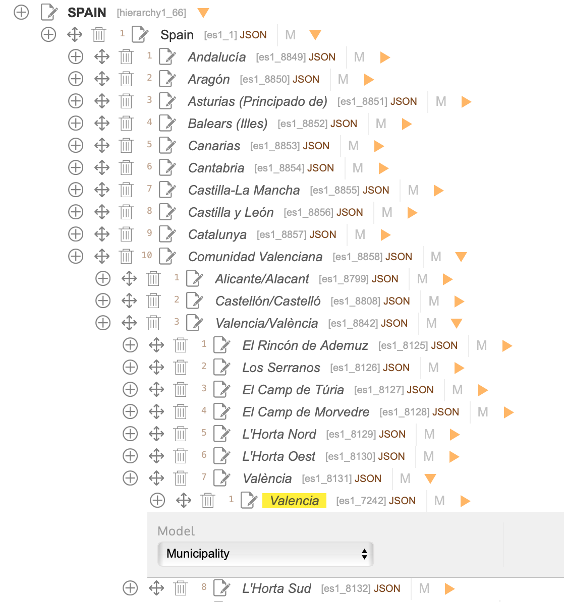

# Publication API

Dédalo Publication API connects your archive data with the web.

## Introduction

Dédalo stores all data in a private PostgreSQL database, only accessible by the back-end.

When it is needed to publish some of the data stored, Dédalo is able to do that through a publication tool (Dédalo diffusion engine).

One of the most used publication services is the SQL publication format, and generally, these published data will be stored in a MySQL or MariaDB database. This database is accessible through Dédalo’s Public API.

Publication process transform your data into different formats as SQL, RDF or any other diffusion format without change your work data. This process is controlled by the ontology definition.

The purpose of this document is to guide you through the different available methods in the API, explaining every option and showing you how to use them with examples, code snippets and much more.

## Diffusion ontology

Diffusion ontology is a specific part of the Dédalo ontology to control what kind of data could be public and how this data need to be processed. The main idea is control the access to private data and how will be showed in the public web.

To understand this, you need to know that some archives has a personal data as tel or address that it can not to be public. And doing this transform you can control what data could be public and what no.

Besides, publication process could transform the original data into different "formats" or "versions".

For example: if you want to show one city, you can choose how this data will be processed by the web, so you can to define different formats to achieve these needs. So, to publish "Valencia" you can think; what kind of data will I need? and format it.

Let me explain. Inside Dédalo a toponymy as Valencia is a thesaurus term with all administrative hierarchy:

{: .small}

Ontology definition to publish this toponymy could be configured to get:

Only the name of the town. The name and all his parents (all administrative hierarchy), the name and the county, name and model (municipality), etc...

So you can create different fields in the publication database with different data:

--- | ---
toponymy    | Valencia
with_parents | Valencia, València, Valencia/Valéncia, Comunitat Valenciana, Spain
toponymy_county | Valencia, Spain
toponymy_model | Valencia, Municipality
etc | etc

If you need search by community ("Comunitat Valenciana") instead the municipality, so, you can do it searching in the field "with_parents", but if you need add one point to map, you will need to  use the geo data, so, you can define to add it to the resolution:

--- | ---
toponymy    | Valencia
geo | `{"alt":16,"lat":39.469860091745815,"lon":-0.3764533996582032,"zoom":12}`

Or you will need to link the term and his parents with the thesaurus table and you can add his locators:

--- | ---
toponymy    | Valencia
data | `["es1_7242"]`
with_parents | Valencia, València, Valencia/Valéncia, Comunitat Valenciana, Spain
data_parents | `["es1_7242", "es1_8131","es1_8842", "es1_8858", "es1_1"]`

The original data "Valencia" could be transformed into different fields to be used as needs without change the original data in PostgreSQL.

Doing those transformations we can adapt the data into publication database to be ready for different applications / optimizations, and create a very efficient websites, because the data is prepared to resolve the needs of the website, and, if in the future, you will need to add another combination not defined, is easy to include it.

### How ontology publication works?

All publication process is defined in Dédalo ontology, and it is dependent of the [diffusion](https://dedalo.dev/ontology/dd3) term.

Ontology defines some models to create a diffusion schema.

Common models

--- | ---
diffusion_domain | entity or tld group (main diffusion term)
diffusion_element | group
diffusion_group | specific group

For SQL:

--- | ---
database | name of MariaDB / MySQL database
database_alias | name of table in database (copy of schema of other database term )
table | name of table in database
table_alias | name of table in database (copy of schema of other table term )
field_boolean | bool field inside table in database
field_date | timestamp field inside table in database
field_decimal | float field inside table in database
field_enum | enum field inside table in database
field_int | in field inside table in database
field_mediumtext | mediumtext field inside table in database
field_point | mediumtext field inside table in database
field_varchar | varchar field inside table in database
field_text | text field inside table in database
field_year | year field inside table in database

 For RDF:

| --- | --- |
| external_ontologies | group of definitions (main  diffusion term) |
| external_ontology   | definition of other ontology                |
| owl:Class           | Class                                       |
| owl:ObjectProperty  | Property                                    |

## Dédalo diffusion engine

It manages Dédalo’s diffusion schema and data.

Diffusion engine will process the Dédalo data and transform to other formats using the diffusion ontology. When user publish data Diffusion engine will do the transoms and store the result into other databases or files using an ontology map that defines what sections and fields will be exported.

> Output could be targeted to another database or to RDF files.

The most common scenario is to publish the data in a separate MariaDB / MySQL database. All the published data is intentionally published by the administrators and therefore, the destination database can be used for consultation without compromising the original data stored in the Dédalo working database.

Dédalo has some configurations already prepared for use as Oral History, Bibliography or Web, but you can build others, following the already existing elements patterns.

Each element of the ontology has several parameters that define the characteristics and the output format of the field in the MySQL table.

For example, the column name, the column type (varchar, text, int, date, etc.) the output processing (diffusion methods to post process the data), etc.

When data is published it will be accessible by the Publication Server API.

## Dédalo Publication Server API

It manages the public server request using a REST interface.

The publication server API can be hosted in the same Dédalo server or in another server used to create a website.
Publication server files are placed by default in Dédalo file structure at:

../httpdocs/dedalo/publication/server_api

but, you can move or copy this folder to another location or server. The only requirement to function is to allow access to the public database and media files.

Requests must be made to:

[https://mydomain.org/my_path/server_api/v1/json/](#dédalo-publication-server-api)

Example to get a list with all available tables in the database:

[http://mydomain.org/my_path/server_api/v1/json/tables_info?code=XXXX](#dédalo-publication-server-api)

The manager receives http requests from the public site, processes them and returns the data in JSON format.

Requests could be made with javascript, php, perl or any language capable of managing REST using json headers.

## Server configurations

Some examples of server configuration and data flow.

1. All system in the same server. The workspace and the diffusion is inside the same server. This configuration is easy to create and maintain, the server has all services, media, but any interference in website or attack will affect to work system.

   
2. Two different servers, one for work system, and another for Diffusion. Pros: the website is totally separated of the work system and you can scale if you have a lot of traffic into website, an attack to the website do no affect to work system. Cons: double maintenance, double cost.

   
3. Three different servers, first for work system, the second for media, the third for diffusion. This configuration ensure that your media files are shared by work system and diffusion system

   

## Data flow

1. User do an action to get information.
2. Website sent a request to the publication API as `Publication API::records`.
3. The request is processed and sended as SQL call to the database.
4. MariaDB/MySQL search into public data and return the result.
5. With the result publication API send a query to get authorization of the media associated.
6. Publication API create the final JSON mixing data and media result to be sended to website.
7. Finally website render the webpage and send to the user browser.

## Publication API Setup

Set up publication API has two parts, activate the config files and setup the constants.

1. Set up Dédalo [Publication API configuration files](./public_api_configuration.md)
2. Dédalo [Publication API configuration](./server_config_api.md)

## Using publication API

The most widely used publication model in Dédalo is the publication on tables in a MySQL database.

Once the publication model (publication ontology) is generated, either using a pre-existing model such as Oral History or creating a custom one.

Dédalo publication API use a REST model to access to public data and we follow the OpenAPI initiative to document it.

The calls to API are sended via GET or POST queries, using variables as code to identify the authorized calls:

`https://mydomain/dedalo/lib/dedalo/publication/server_api/v1/json/tables_info?code=XXXX`

The documentation API is accessible in the path:

`../dedalo/publication/server_api/v1/docu/ui/`

